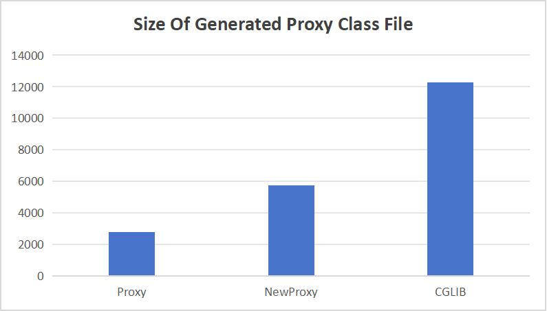
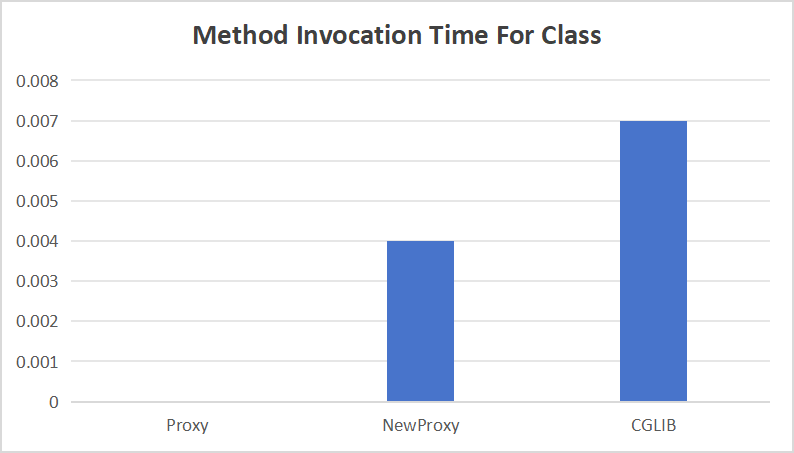
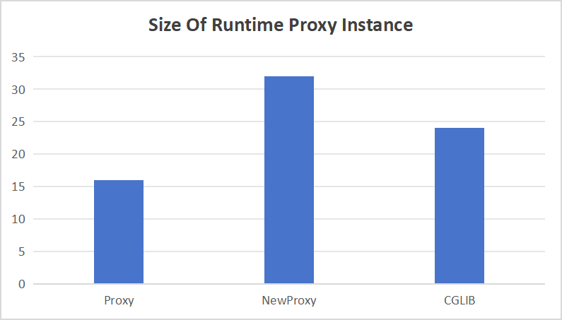

# NewProxy Samples

In this project, a comparison was made between the time to generate proxy classes, time to invoke methods and
the size of generated class file and runtime proxy instance.
All results are listed in [Benchmark_Results.md](./Benchmark_Result.md).

From that, we may infer that

* In terms of proxy class generation time, `Proxy` is the best, followed by `CGLIB`, and `NewProxy` is the worst.

* In terms of proxy method invocation time for interfaces, `NewProxy(MethodHandle)` is a little bit better than any
  other approaches.

* In terms of proxy method invocation time for class, `NewProxy` is better than `CGLIB`, and `Proxy` does not support
  this feature.

* In terms of generated proxy class file, `Proxy` has the smallest size, followed by `NewProxy`, and `CGLIB` has the
  biggest size, since `CGLIB` generates a proxy class file with corresponding **FastClass**
  index.

* In terms of runtime proxy instance, `Proxy` has the smallest size, followed by `CGLIB`, and `NewProxy` has the
  biggest size.

* In terms of the complexity of the proxy, `Proxy` generates the clearest proxy class, followed by `NewProxy`,
  and `CGLIB` generates the most complex proxy class (generated proxy classes can be dumped,
  see [BenchmarkOfSizeForProxyInstance.java][target]. And I have referred to many code implementations of `Proxy` when
  coding `NewProxy`).

[target]: ./src/main/java/io/github/lamspace/newproxy/benchmark/BenchmarkOfSizeForProxyInstance.java

---
